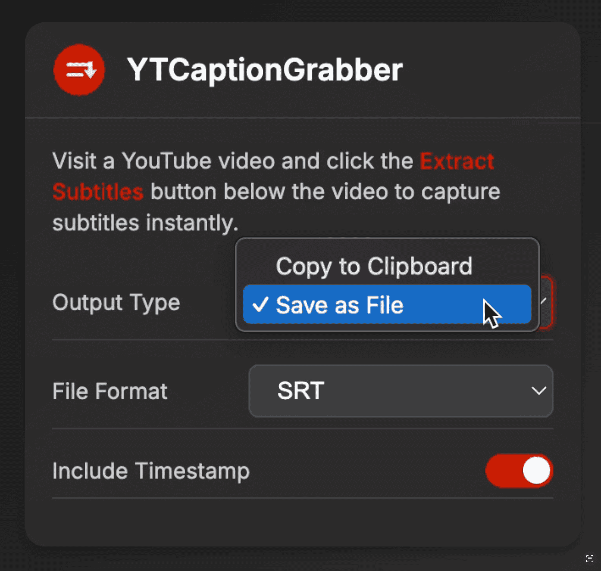
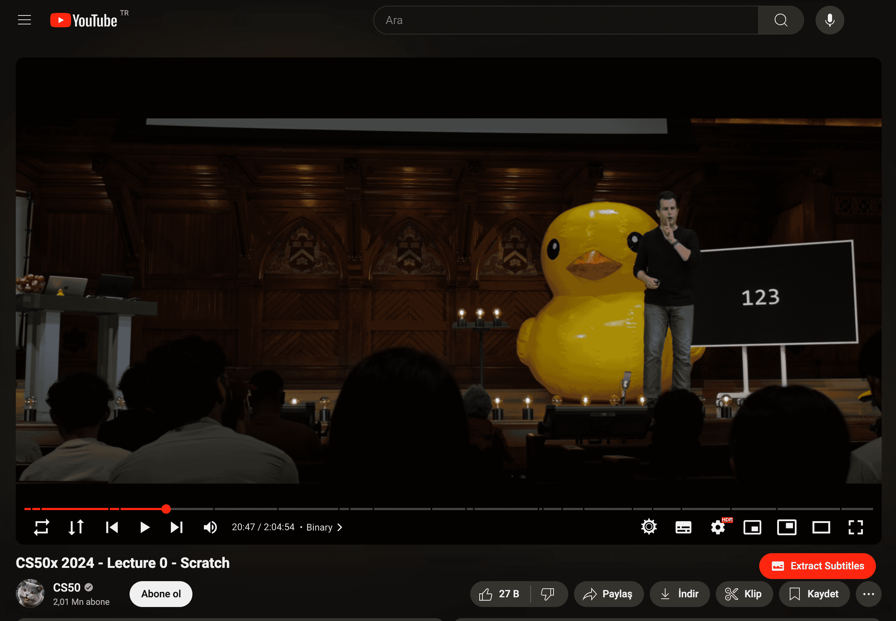

#  YTCaptionGrabber

A Chrome extension that allows you to easily extract subtitles from YouTube videos with just one click.

## 🎯 Features

- **Easy to Use**: Simply click the "Extract Subtitles" button below any YouTube video
- **Multiple Output Options**: 
  - Copy to clipboard
  - Save as file
- **Flexible Format Support**:
  - SRT (SubRip)
  - VTT (WebVTT)
  - TXT (Plain text)
- **Timestamp Options**: Include or exclude timestamps in the extracted subtitles

## 📸 Screenshots

### Extension Interface

  

### Extract Button on YouTube

  

## 🚀 Installation

1. Download or clone this repository
2. Open Chrome and navigate to `chrome://extensions/`
3. Enable "Developer mode" in the top right corner
4. Click "Load unpacked" and select the extension directory

## ⚙️ Settings

You can customize the extension behavior through the popup menu:

- **Output Type**: Choose between clipboard or file output
- **File Format**: Select SRT, VTT, or TXT format (when saving as file)
- **Include Timestamp**: Toggle timestamp inclusion in the output

## 📄 License

This project is open source and available under the MIT License.
